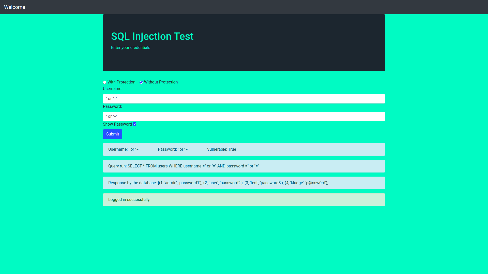
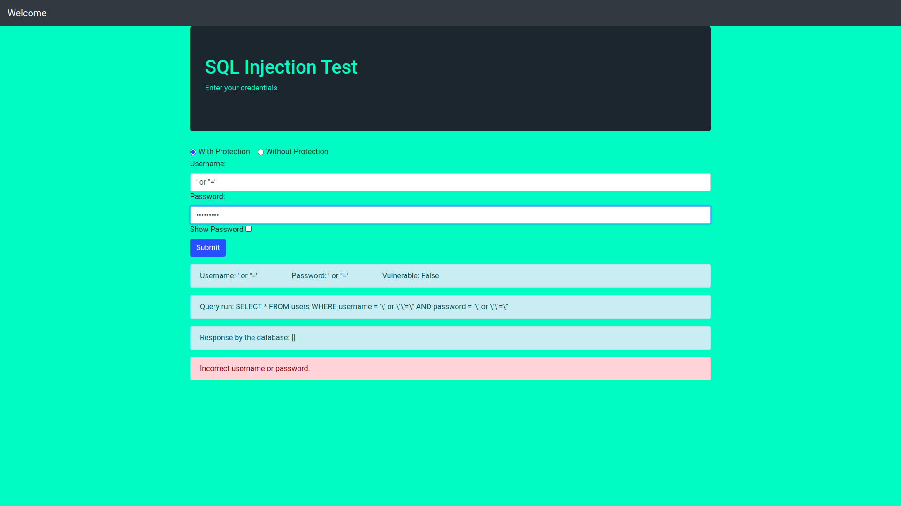

# SQL-Injection-Demo

## Description

This project was done for Kludge, the Information Security and Networking Club of IIT Hyderabad.
   
SQL is a language employed in websites to interact with databases. It allows the website to create, retrieve, update and delete database records.
  
An SQL injection is a security vulnerability that allows an attacker to inject malicious SQL statements into a web application's input fields and gain unauthorized access to sensitive data such as usernames, passwords and credit card credentials.
  
In this project, we demonstrate how SQL injection attacks work and the simple measures to mitigate them.

## Demo
Below is a simple example of running an SQL injection attack on the login page, with and without mitigation.  

1. Without mitigation:  
	&nbsp;   
	&nbsp; As we can see, we are able to login without knowing the password.

2. With mitigation:  
	&nbsp;   
	&nbsp; The attack is blocked as we sanitize the input before executing the SQL query. 

## Installation and setup

* First install flask and mySQL:   
`pip3 install flask`  
`pip3 install mysql-connector-python`

* You also need to ensure your system has mySQL. Install it with the command `sudo apt-get install mysql-server` if mysql is not present. You will also need to configure the root password for mySQL (google). Then in app.py, change the values of username and password to your mySQL root username and password.

* Then run the following commands to create the database and table: 
`mysql -u root -p`   # enter your password when prompted (configured above)  
`CREATE DATABASE users_db;`  
`USE users_db;`  
`CREATE TABLE users (id INT AUTO_INCREMENT PRIMARY KEY, username VARCHAR(255), password VARCHAR(255));`  
`INSERT INTO users (username, password) VALUES ('admin', 'password1');`  
`INSERT INTO users (username, password) VALUES ('user', 'password2');`  
`INSERT INTO users (username, password) VALUES ('test', 'password3');`   
`INSERT INTO users (username, password) VALUES ('kludge', 'p@ssw0rd');`

* Then run the following command to start the server:  
`python3 app.py`
